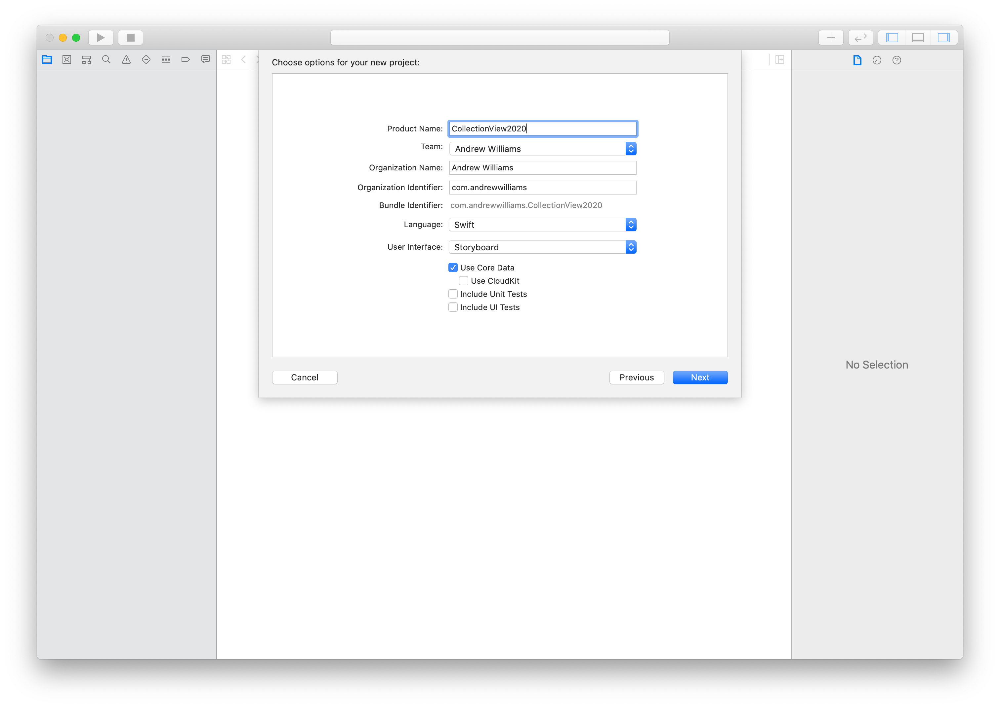
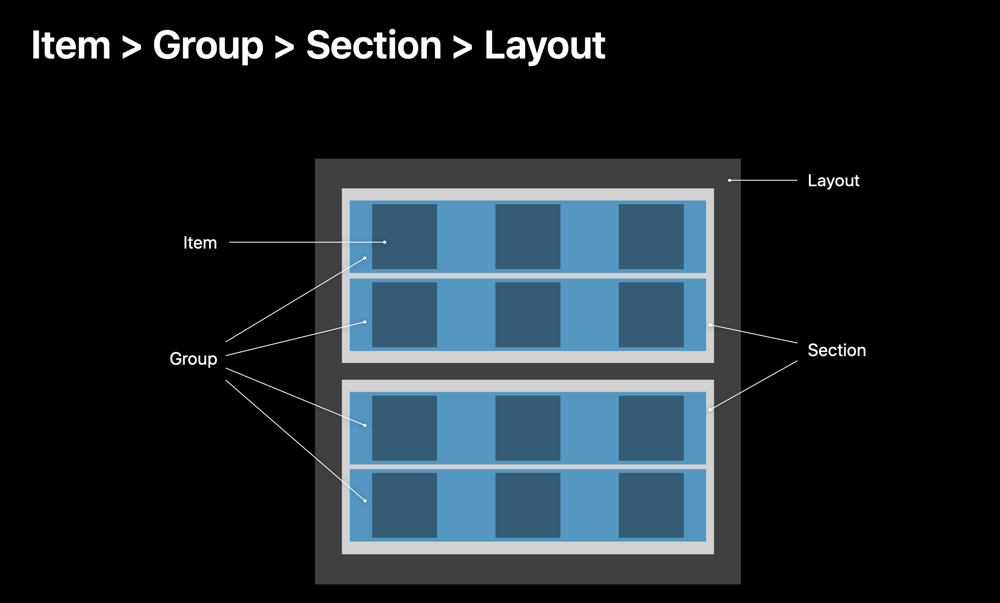
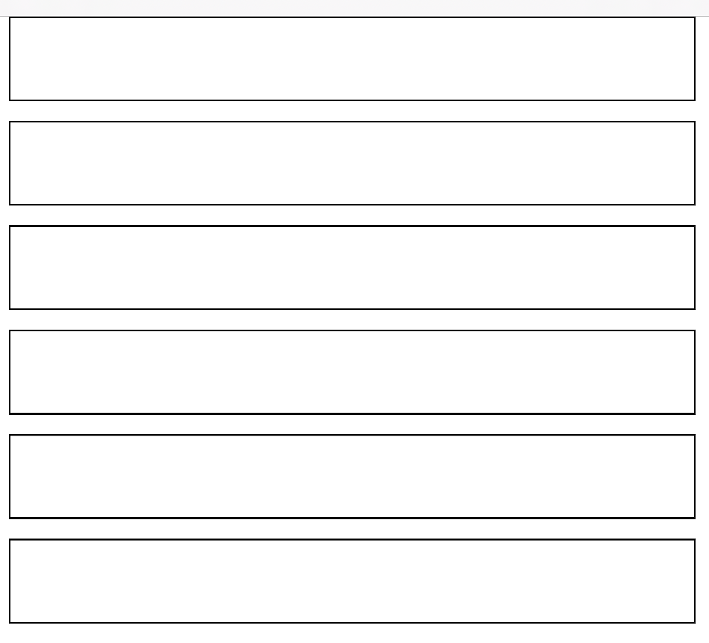
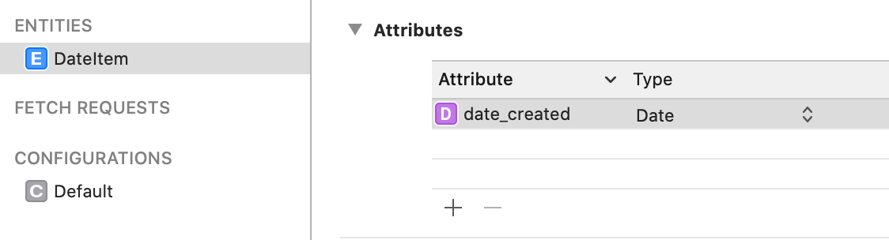
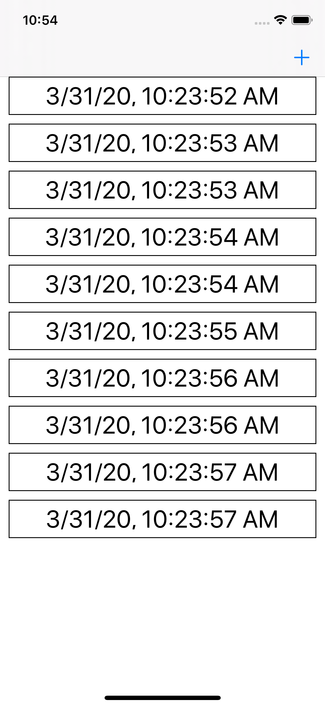

# Setting up a UICollection View with Compositional Layout, Diffable Data Source, and Core Data

UICollectionViews received a massive update at WWDC 2019 in the form of Diffable Data Sources and Compositional Layout. These new APIs have simplified layout and data source code for collection views and are a real joy to use. Furthermore, Core Data received some great API updates that promise to connect it to your collection views in a much more seamless way than ever before. 

But if you're like me, you may find that connecting these three pieces - Compositional Layout, Diffable Data Source, and Core Data - isn't quite as easy at it looks on the WWDC slides. If so, this tutorial will show you how to do so, including some key tweaks from what was shown on stage to what shipped with iOS 13 last fall.

When we’re finished, we’ll have a simple app that allows you to create new cells with the date that persist between launches. It’s not an impressive app by itself, but you’ll gain an understanding of how connect these powerful components in order to extend them in your own apps.

This tutorial assumes a fluency in Swift, as well as previous experience with Core Data (specifically NSFetchedResultsController) and Collection Views.

To get started, open Xcode and create a new project. Give it whichever name you’d like and select the ‘Use Core Data’ checkbox. Select ‘Storyboard’ for User Interface.



## Collection view - add compositional layout code.

The first piece of our trifecta is Compositional layouts.

Compositional layouts allow you to describe how you’d like your collection view objects to relate to each other, and lets the framework take care of displaying those objects on screen.

In this layout system, you start with the smallest objects - Items - and work your way up to to create a UICollectionViewLayout object which describes the entire layout and can then be passed onto your UICollectionView object.

The four objects that you’ll be creating are:

Item
Group
Section
Layout

You can see the relationship between them in this slide from WWDC:


[WWDC 2019 Session 215 - Advances in Collection View Layout](https://developer.apple.com/videos/play/wwdc2019/215/)

The way that you relate these objects to each other and describe their sizes is through fractional and absolute sizes. 

When using fractional sizes, you are describing an objects width or height relative to that of its container. So, for example, an Items height or width would be relative to its group, and a group to its section.

You can also describe an items size using absolute terms if you need an item to be a specific height or width, regardless of its containers size.

To start, add the property below to the top of your newly created ViewController.swift file.

```
var collectionView: UICollectionView! = nil
```

### Setup create layout method:

Next, we're going to setup our createLayout method. This method is responsible for describing our items, groups, and sections and returns a UICollectionViewCompositionalLayout object.

```
func createLayout() -> UICollectionViewLayout {
        let itemSize = NSCollectionLayoutSize(widthDimension: .fractionalWidth(1.0),heightDimension: .fractionalHeight(1.0))
        let item = NSCollectionLayoutItem(layoutSize: itemSize)

        let groupSize = NSCollectionLayoutSize(widthDimension: .fractionalWidth(1.0), heightDimension: .absolute(44))
        let group = NSCollectionLayoutGroup.horizontal(layoutSize: groupSize, subitem: item, count: 1)

        let section = NSCollectionLayoutSection(group: group)
        let spacing = CGFloat(10)
        section.interGroupSpacing = spacing
        section.contentInsets = NSDirectionalEdgeInsets(top: 0, leading: 10, bottom: 0, trailing: 10)

        let layout = UICollectionViewCompositionalLayout(section: section)
        return layout
    }
```

Let's step through this.

The first two lines describe our item size using fractions - both the height and width are set to 1.0, meaning that the item will take up the full height and width of it's group.

Next up we create our group and tell it to take up the full width of it's section, and give it an absolute height of 44. We then tell it to include the item objects created in the previous two lines, and lastly tell it that each group contains one of those items.

Next, we create our section - our example app will only have one section, but you could easily create one with many sections. To create our section, we simply pass in our previously created group. The next few lines of code to add spacing between our groups and to inset our content from the edges of the screen.

Lastly, we create a layout object by passing in the section object we just created.

The screenshot below shows our newly created layout using the above code.




### Create Collection View Using Layout Method

Once we have our collection view layout code, we can create our collectionView object and setup some basic AutoLayout code before adding the collectionView to our view.

Add the below method to your ViewController.swift file.

```
func configureHierarchy() {
        collectionView = UICollectionView(frame: view.bounds, collectionViewLayout: createLayout())
        collectionView.autoresizingMask = [.flexibleWidth, .flexibleHeight]
        collectionView.backgroundColor = .systemBackground
        collectionView.register(DateCell.self, forCellWithReuseIdentifier: DateCell.reuseIdentifier)
        view.addSubview(collectionView)
        
    }
```

### Create UICollectionViewCell subclass

You’ll notice that after pasting the above code in, Xcode will give you an error stating that the class DateCell doesn’t exist. Let’s create it.

This subclass is necessary to tell the collectionView what goes inside each cell and how to lay it out.

Create a new Swift file called DateCell.swift and paste the below code into it.

```
import UIKit

class DateCell: UICollectionViewCell {
    let label = UILabel()
    static let reuseIdentifier = "date-cell-reuse-identifier"

    override init(frame: CGRect) {
        super.init(frame: frame)
        configure()
    }
    required init?(coder: NSCoder) {
        fatalError("not implemnted")
    }
    
    func configure() {
        label.translatesAutoresizingMaskIntoConstraints = false
        contentView.addSubview(label)
        label.font = UIFont.preferredFont(forTextStyle: .caption1)
        let inset = CGFloat(10)
        NSLayoutConstraint.activate([
            label.leadingAnchor.constraint(equalTo: contentView.leadingAnchor, constant: inset),
            label.trailingAnchor.constraint(equalTo: contentView.trailingAnchor, constant: -inset),
            label.topAnchor.constraint(equalTo: contentView.topAnchor, constant: inset),
            label.bottomAnchor.constraint(equalTo: contentView.bottomAnchor, constant: -inset)
            ])
    }

}
```

## Collection view - add data source methods.

Now that we've told our collectionView how to layout cells, and our cells how and what they need to layout, we need to tell the collection view what data to display. To do that, let's set up our collection view data source.

Head back to your ViewController.swift file and Import Core Data at the top of the file.

Then, add your data source property above the viewDidLoad method.

```
var dataSource: UICollectionViewDiffableDataSource<String, NSManagedObjectID>! = nil
```

Next, let's add a method to configure our collection view data source.

```
func configureDataSource() {
        dataSource =  UICollectionViewDiffableDataSource<String, NSManagedObjectID>(collectionView: collectionView) {
        (collectionView: UICollectionView, indexPath: IndexPath, itemID: NSManagedObjectID) -> UICollectionViewCell? in
            let item = self.fetchedResultsController.object(at: indexPath)

            guard let cell = collectionView.dequeueReusableCell(
                withReuseIdentifier: DateCell.reuseIdentifier,
                for: indexPath) as? DateCell
                else { fatalError("Cannot create new cell") }
            
            guard let date = item.date_created
                else {fatalError("No date found for item")}

            let formatter = DateFormatter()
            formatter.dateStyle = .short
            formatter.timeStyle = .medium
            
            cell.label.text = "\(formatter.string(from:date))"
            cell.layer.borderColor = UIColor.black.cgColor
            cell.layer.borderWidth = 1
            cell.label.textAlignment = .center
            cell.label.font = UIFont.preferredFont(forTextStyle: .title1)

            return cell
        }

    }
```

There are a number of key items in here - let's step through them one by one.

The first one is the Section and Item identifier types that you give to the UICollectionViewDiffableDataSource object:

```
UICollectionViewDiffableDataSource<String, NSManagedObjectID>
```

In the above line, String is the Section Type, and NSManagedObjectID is the Item Identifier type. 

The UICollectionViewDiffableDataSource allows you to use any hashable object for your Section and Item types. For example, you could create an enum for all of your sections and use that as the type. 

However, NSFetchedResultsController will only vend sections as String and Item Idenfifiers as NSManagedObjectIDs, so it's key that you use those types when setting up your data source.

You also pass in a reference to our previously created collectionView object, which the data source will use to wire itself to that collection view.

Next you'll notice a trailing closure, which mimics the cellForRowAtIndexPath method that was previously used to set up collection view cells.

Passed into this trailing closure are 3 objects, the collectionView that is displaying the data, the indexPath of the cell that is being populated, and the item identifier - which will vary based on the Item Identifier type you specified above. That last part is key, because it allows us to use the NSManagedObjectID to grab the object from core data that we need.

From there, we can setup our cell and modify it's properties just as we would in a traditional cellForRowAtIndexPath method.

## Core data - add model info (name, date)
At this point, Xcode is complaining because we’re referencing something called a fetchedResultsController, but we haven’t set one up yet. Let’s fix that.

First, let’s go into our Core Data model - by default it’s below your Info.plist and is given the same name as your project - and create a new Entity called DateItem. We’ll add a single property to this entity called date_created, and make it of type Date.




## Core data - setup NSFetchedResultsController.
With our Entity and Attribute setup, we can create our NSFetchedResultsController - which is essentially a live search of your Core Data model. 

Any time an object in your model which matches your search is updated, added, or deleted, the NSFetchedResultsController notifies its delegate methods. In the past this came in the form of several methods that took a lot of boiler plate code to correctly wire up to your collection view.

With DiffableDataSource in iOS13, you can now connect a NSFetchedResultsController to your collection view quickly and easily.

Let’s head back to our ViewController and add the code for our NSFetchedResultsController.

### Add fetchedResultsController, App Delegate, and ManagedObjectContext properties to the top of your ViewController.swift file

```
var fetchedResultsController: NSFetchedResultsController <DateItem>!

let appDelegate = UIApplication.shared.delegate as! AppDelegate
    
var managedObjectContext : NSManagedObjectContext!
```

### Add a configureCoreData method

```
func configureCoreData() {
        managedObjectContext = appDelegate.persistentContainer.viewContext
    }
```

When we checked the 'Core Data' box during our project creation, Xcode setup a number of methods for us to get us started with Core Data. While they may not be ideal for a larger project, they're enough to get us started with in this tutorial. The code above grabs a NSManagedObjectContext from our App Delegate which we can then use to create objects and search for them using our NSFetchedResultsController.

### Complete configureFRC method

The creation of a NSFetchedResultsController hasn't changed with diffable data sources - you create a fetch request, set your sort descriptors and any desired predicates, then call performFetch, catching any errors that may occur.
 
```
func configureFRC() {
        let fetchRequest = NSFetchRequest<DateItem>(entityName: "DateItem")
        fetchRequest.sortDescriptors = [NSSortDescriptor(key: "date_created", ascending: true)]
        
        fetchedResultsController = NSFetchedResultsController(fetchRequest: fetchRequest, managedObjectContext: managedObjectContext, sectionNameKeyPath: nil, cacheName: nil)
        do {
            fetchedResultsController.delegate = self
            try fetchedResultsController.performFetch()
        } catch {
            let fetchError = error as NSError
            print("Fetch error: \(fetchError), \(fetchError.userInfo)")
        }
    }
```

## Conform to NSFetchedResultsControllerDelegate

This is where the real magic of diffable data source comes in - in order to connecting a NSFetchedResultsController to a UICollectionView used to require dozens of lines of code, and even then was prone to state errors. Many developers simply gave up and called reloadData on their collectionViews, resulting in glitchy UIs.

With diffable data source and improvements in the NSFetchedResultsController API in iOS 13, you can now connect the two pieces using just the code below.

Every time your data model changes in a way that affects the search you setup with your NSFetchedResultsController, the didChangeContentWith snapshot method below is called. 

We then call the apply method on our data source, passing in a snapshot of the changes created by our NSFetchedResultsController. The data source takes care of the rest - removing items that longer exist, updating items that have changed, and adding new items into our collection view. It even animates those changes for us.

```
extension ViewController : NSFetchedResultsControllerDelegate {
    
    func controller(_ controller: NSFetchedResultsController<NSFetchRequestResult>, didChangeContentWith snapshot: NSDiffableDataSourceSnapshotReference) {
        guard dataSource != nil else { return }
        
        dataSource.apply(snapshot as NSDiffableDataSourceSnapshot, animatingDifferences: true)
        
    }
    
}
```

## Add UI To Create Date Cells
In order to add data to our core data model and see the updates reflected in our collection view, let's add a simple button that creates and saves a new DateItem object with its creation date.

### Embed View Controller in a Navigation View Controller

First, let's embed our view controller in a Navigation View Controller so that we can add a button to the navigation bar.

To do that, open your Main.storyboard file and select the one View Controller visible in the storyboard. Then, head up to the Editor menu, and select Embed In > Navigation Controller.

### Create newItem method

Heading back to the ViewController.swift file, create the below method which will create and save a new DateItem object in Core Data along with the date it was created.

```
@objc func newItem() {
        let item = DateItem(context: managedObjectContext)
        item.date_created = Date()
        appDelegate.saveContext()
    }
```

### Add UIBarbutton

We'll need a way to call this method from the UI, so let's add a simple plus button to our Navigation bar using the below method, and point it to our newItem method.

```
func configureButtons() {
        self.navigationItem.rightBarButtonItem = UIBarButtonItem(barButtonSystemItem: .add, target: self, action: #selector(newItem))
    }
```

### Add config methods to viewDidLoad

Lastly, we'll need to make sure all of our methods are called and in the proper order after the view finishes loading. Make sure your viewDidLoad method looks like the one below.

```
override func viewDidLoad() {
        super.viewDidLoad()
        // Do any additional setup after loading the view.
        configureCoreData()
        configureHierarchy()
        configureDataSource()
        configureButtons()
        configureFRC()
    }
```

That's it! Go ahead and launch your app in the simulator, and you should be able to tap the plus button and see new cells created with a timestamp of their creation date, like in the screenshot below.



This is a super simple app, but this foundation can be easily extended to load JSON data from the web, via drag and drop on iPad, etc.

If you're interested, the full project code for this tutorial can be dowloaded [here](https://github.com/andrewwilliams/GaiaHowTo)

## Wrap Up and Further Reading 

[Advances in UI Data Sources - WWDC 2019 - Videos - Apple Developer](https://developer.apple.com/videos/play/wwdc2019/220/)
[Advances in Collection View Layout - WWDC 2019 - Videos - Apple Developer](https://developer.apple.com/videos/play/wwdc2019/215/)
[Making Apps with Core Data - WWDC 2019 - Videos - Apple Developer](https://developer.apple.com/videos/play/wwdc2019/230/)


